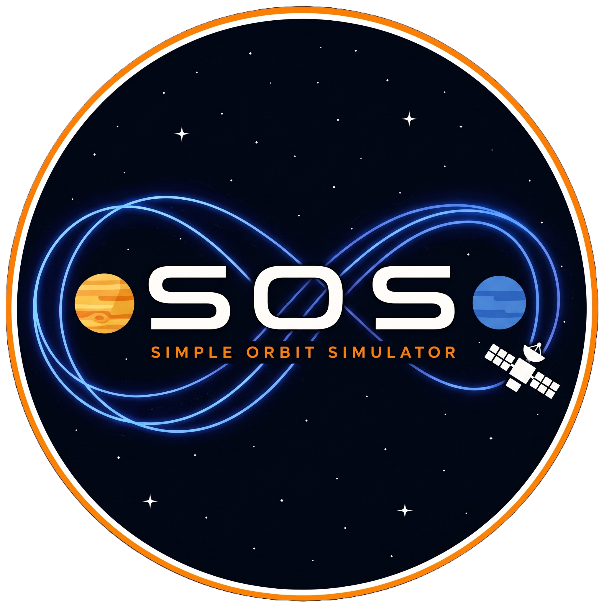
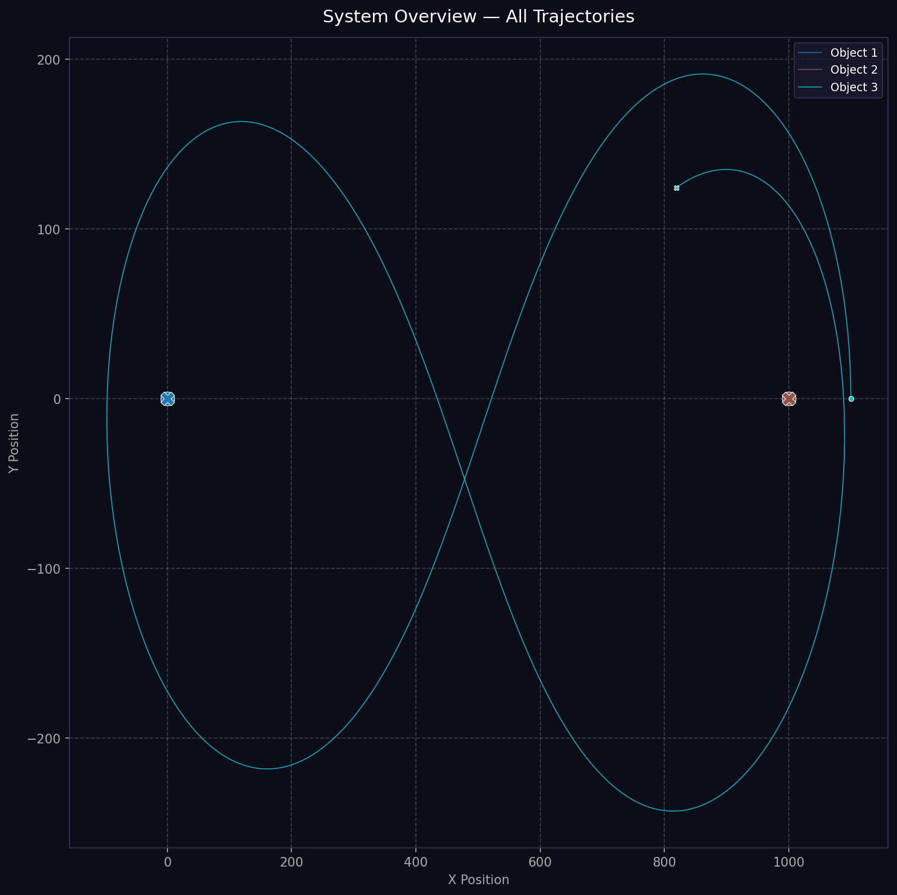
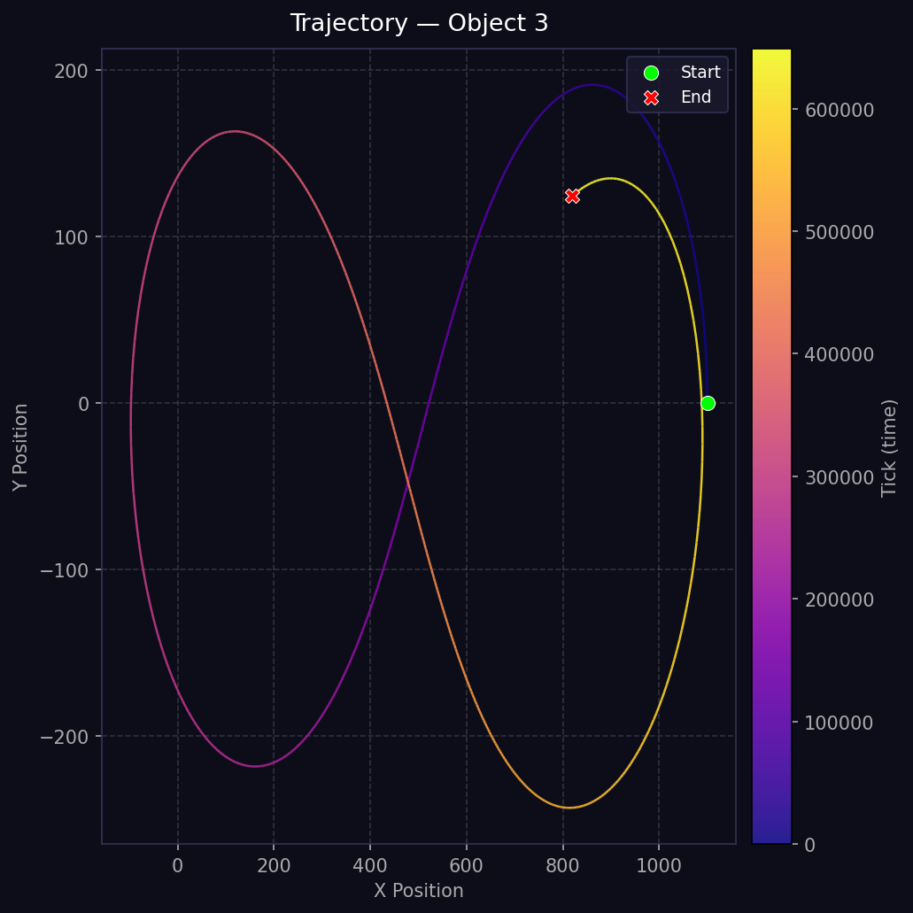
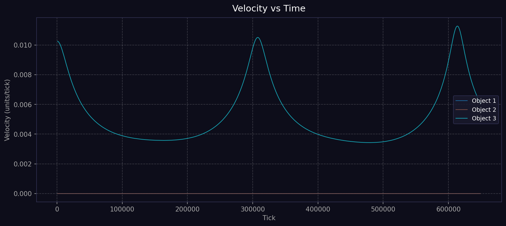
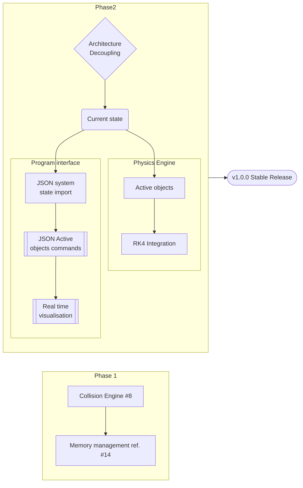
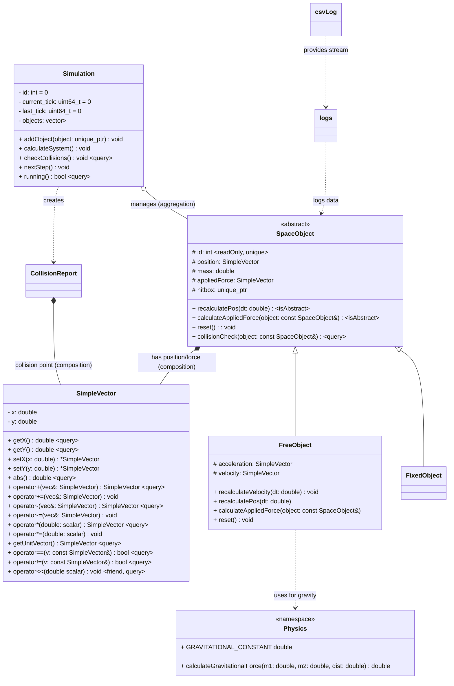
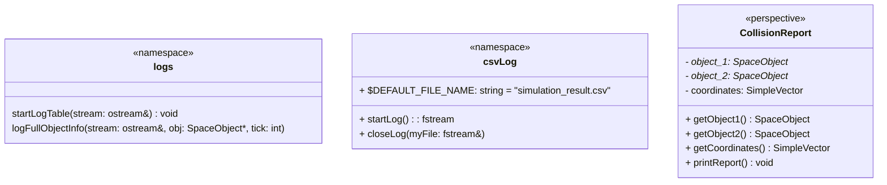

<table border="0">
  <tr>
    <td width="300" align="center" valign="middle">
      
    </td>
    <td valign="middle">
      <h1>Simple Orbit Simulator</h1>
      <p><b>N-body orbital mechanics engine</b></p>
      <p><i>Because space is big, but physics is universal.</i></p>
      <p>
        
        
        
      </p>
    </td>
  </tr>
</table>

## Description
A lightweight, modular C++17 engine for N-body orbital mechanics. Originally a training project in physics and OOP, SOS is now evolving into an open-source tool for stable, high-performance space flight simulation.

<div align="center">
  
  
  
</div>

## Current State
The project currently features a functional 2D orbital mechanics core. It supports multi-body simulations where gravity is calculated using Newton's Law, and results are exported as .csv ready diagrams for external analysis.

### Implemented Features
- **Physics Core**: N-body gravitational interaction and Euler integration for movement
- **Vector Library**: Custom `SimpleVector` class for 2D vector mathematics
- **Objects Architecture**: `SpaceObject` hierarchy allowing for stationary and dynamic objects
- **Data Logging**: CSV-based logger that records object trajectories (position, velocity, mass)
- **Test Suite**: Integrated unit testing framework for core modules
- **Post-Simulation Analysis**: Python suite for generating publication-quality orbital diagrams.

### Planned features
- [ ] **Visualisation** - implement "real time" visualisation
- [ ] **Better user interface** - console input of simulation and object data
- [x] **Collision Engine** - add collision models and collision handling
- [ ] **Propulsion** - Add `ActiveObject` class to simulate thrusters and orbital maneuvers.

### Current Roadmap


## Getting Started

### Prerequisites
* C++17 compatible compiler (GCC, Clang, or MSVC)
* CMake 4.2.3+
* Python 3.8+ (for visualisation)

### Build and Run
```bash
mkdir build && cd build
cmake ..
cmake --build .
./simulation
```

## Architecture description:

### Core Classes
1) `SpaceObject` - Base class for all objects in the Simulation.
    - `FixedObject` - "Steady" objects or origins, like the Sun in a Solar System model or Earth in an Earth-Moon-Spaceship system.
    - `FreeObject` - All other objects which can move based on physics.
    - *[perspective]* `ActiveObject` - Objects which can move using their own thrust.
2) `Simulation` - The class that contains the simulation loop and objects.
3) `SimpleVector` - Core 2D vector math and logic.
4) *[dev]* `Hitbox` - Class to detect and handle collisions.
5) *[perspective]* `Graphics` - The visual part of the simulation.
6) `Logger` - Save the results of simulation
7) `Visualisation` - Output as trajectories and graphics

### Core class diagram



### App class diagram



## Simulation Setup Guide

This guide explains how to integrate the engine into your own `main.cpp`.

### 1. Create Simulation and Objects
Initialize the simulation with the total number of ticks and the time-step (`dt`). Use `FixedObject` for stationary bodies (like a Sun) and `FreeObject` for dynamic bodies (like planets).

```cpp
// 1,000,000 steps with a time-step of 0.1 seconds
uint64_t totalTicks = 1000000;
double dt = 0.1;
Simulation sim(totalTicks, dt);

SpaceObject* sun = sim.createFixedObject(1.989e30, SimpleVector(0, 0));
SpaceObject* earth = sim.createFreeObject(5.972e24, SimpleVector(1.496e11, 0), SimpleVector(0, 29780));
```

### 2. Initialize Logger

Add your objects to the simulation. Then, open the CSV output file and write the table headers.
```c++
// Opens 'simulation_results.csv' and writes CSV headers
std::fstream logFile = csvLog::startLog(); 
logs::startLogTable(logFile);
```

### 3. Run the Simulation Loop

The simulation calculates forces and updates positions in each step. To log multiple objects efficiently, store them in a vector and iterate through them at your desired intervals.

```c++
int snapShotInterval = 5000; // Log data every 5000 ticks

while (sim.running()) {
    // Perform physics calculations
    sim.calculateSystem();

    // Log the state of all objects at the interval
    if (sim.getCurrentTick() % snapShotInterval == 0) {
        for (auto* obj : logList) {            
            logs::logFullObjectInfo(file, earth, sim.getCurrentTick());
            logs::logFullObjectInfo(file, moon, sim.getCurrentTick());
        }
    }

    sim.checkCollisions();
    // Advance to the next tick
    sim.nextStep();
}
```

4. Finalize

Always close the file stream after the simulation finishes to ensure all data is saved correctly.

```c++
csvLog::closeLog(logFile);
```

## Post-Simulation Analysis

The simulator includes a dedicated Python suite to transform raw `.csv` data into physical diagrams. This allows for verification of orbital stability, Keplerian laws, and energy conservation.

### Features
* **System Overview**: Full trajectory paths with mass-proportional markers.
* **Temporal Analysis**: Color-coded paths showing the progression of time.
* **Physics Graphs**: Automatic generation of Velocity-vs-Time and Altitude-vs-Time plots.

### How to Run visualisation

#### 1. **Prepare Environment** (recommended):

```bash
python -m venv .venv
source .venv/bin/activate  # Linux/macOS
# or .venv\Scripts\activate on Windows
pip install -r requirements.txt
```

#### 2. Generate Plots:

```bash
python scripts/visualize.py build/simulation_result.csv
```

## 🤝 Contributors

Special thanks to the community members who help make SOS better:

* **Timur, [@nerooon123](https://github.com/nerooon123)** — Developed the Python visualisation suite.

> Want to contribute? Feel free to fork the repo and submit a Pull Request!
