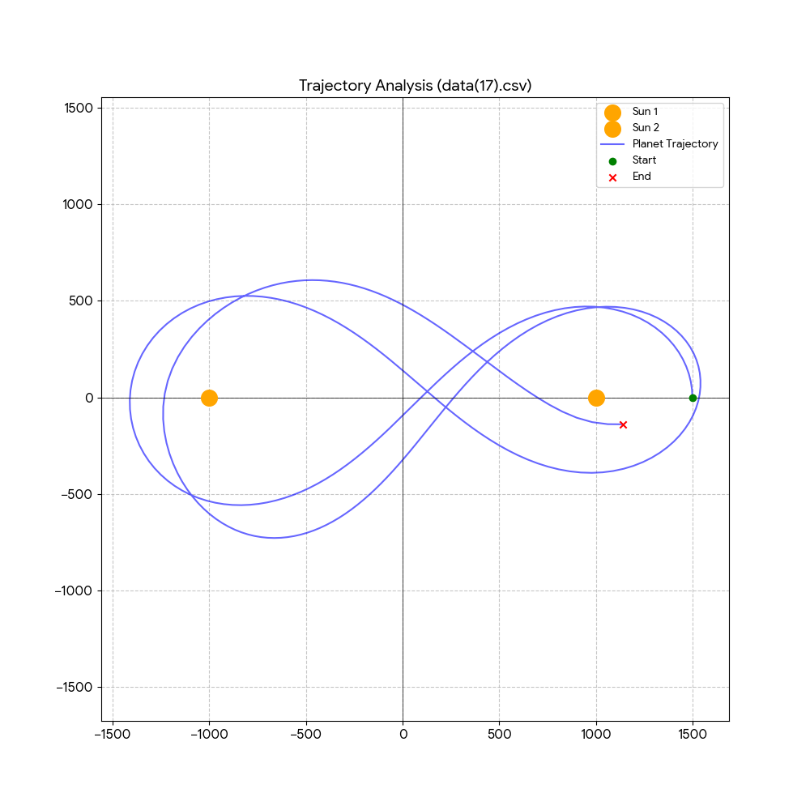
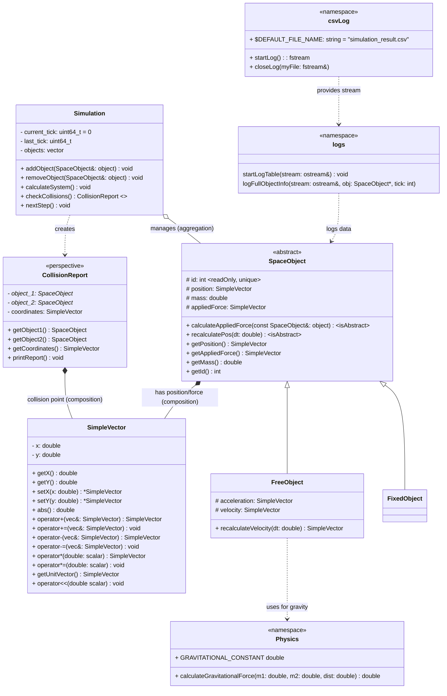
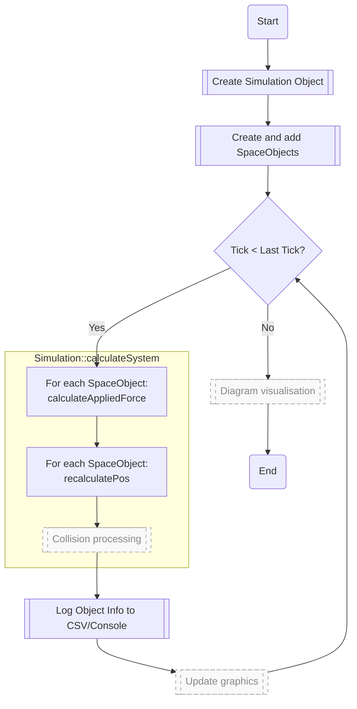

# SOS - Simple Orbit Simulator

## Description
A simple, lightweight C++-based orbital mechanics simulator. It was developed as a training project in physics, mathematics, and object-oriented programming in C++.



## Current State
The project currently features a functional 2D orbital mechanics core. It supports multi-body simulations where gravity is calculated using Newton's Law, and results are exported for external analysis.

### Implemented Features
- **Physics Core**: N-body gravitational interaction and Euler integration for movement
- **Vector Library**: Custom `SimpleVector` class for 2D vector mathematics
- **Flexible Architecture**: `SpaceObject` hierarchy allowing for stationary and dynamic objects
- **Data Logging**: CSV-based logger that records object trajectories (position, velocity, mass)
- **Test Suite**: Integrated unit testing framework for core modules

### Roadmap
- [ ] **Visualization** - implement "real time" visualisation and trajectory diagrams generation
- [ ] **Better user interface** - console input of simulation and object data
- [ ] **Collision Engine** - add collision moddels and collision handling
- [ ] **Propulsion** - Add `ActiveObject` class to simulate thrusters and orbital maneuvers.

## Getting Started

### Prerequisites
* C++17 compatible compiler (GCC, Clang, or MSVC)
* CMake 4.2.3+

### Build and Run
```bash
mkdir build && cd build
cmake ..
cmake --build .
./simulation
```

## Architecture description:

### Core Classes
1) `SpaceObject` - Base class for all objects in the Simulation.
    - `FixedObject` - "Steady" objects or origins, like the Sun in a Solar System model or Earth in an Earth-Moon-Spaceship system.
    - `FreeObject` - All other objects which can move based on physics.
    - *[perspective]* `ActiveObject` - Objects which can move using their own thrust.
2) `Simulation` - The class that contains the simulation loop and objects.
3) `SimpleVector` - Core 2D vector math and logic.
4) *[perspective]* `CollisionReport` - Class to detect and handle collisions.
5) *[perspective]* `Graphics&Visualisation` - The visual part of the simulation.
6) `Logger` - Save the results of simulation



## Process

Currently outlining the "Idea" Flowchart for the main engine loop:



## Simulation Setup Guide

This guide explains how to integrate the engine into your own `main.cpp`.

### 1. Create Simulation and Objects
Initialize the simulation with the total number of ticks and the time-step (`dt`). Use `FixedObject` for stationary bodies (like a Sun) and `FreeObject` for dynamic bodies (like planets).

```cpp
// 1,000,000 steps with a time-step of 0.1 seconds
uint64_t totalTicks = 1000000;
double dt = 0.1;
Simulation sim(totalTicks, dt);

FixedObject sun(1, 1.989e30, SimpleVector(0, 0));
FreeObject earth(2, 5.972e24, SimpleVector(1.496e11, 0), SimpleVector(0, 29780));
```

### 2. Register Objects and Initialize Logger

Add your objects to the simulation. Then, open the CSV output file and write the table headers.
```c++
sim.addObject(&sun);
sim.addObject(&earth);

// Opens 'simulation_results.csv' and writes CSV headers
std::fstream logFile = csvLog::startLog(); 
logs::startLogTable(logFile);
```

### 3. Run the Simulation Loop

The simulation calculates forces and updates positions in each step. To log multiple objects efficiently, store them in a vector and iterate through them at your desired intervals.

```c++
int snapShotInterval = 5000; // Log data every 5000 ticks
std::vector<SpaceObject*> logList = { &sun, &earth };

while (sim.getCurrentTick() < sim.getLastTick()) {
    // Perform physics calculations
    sim.calculateSystem();

    // Log the state of all objects at the interval
    if (sim.getCurrentTick() % snapShotInterval == 0) {
        for (auto* obj : logList) {
            logs::logFullObjectInfo(logFile, obj, sim.getCurrentTick());
        }
    }

    // Advance to the next tick
    sim.nextStep();
}
```

4. Finalize

Always close the file stream after the simulation finishes to ensure all data is saved correctly.

```c++
csvLog::closeLog(logFile);
```