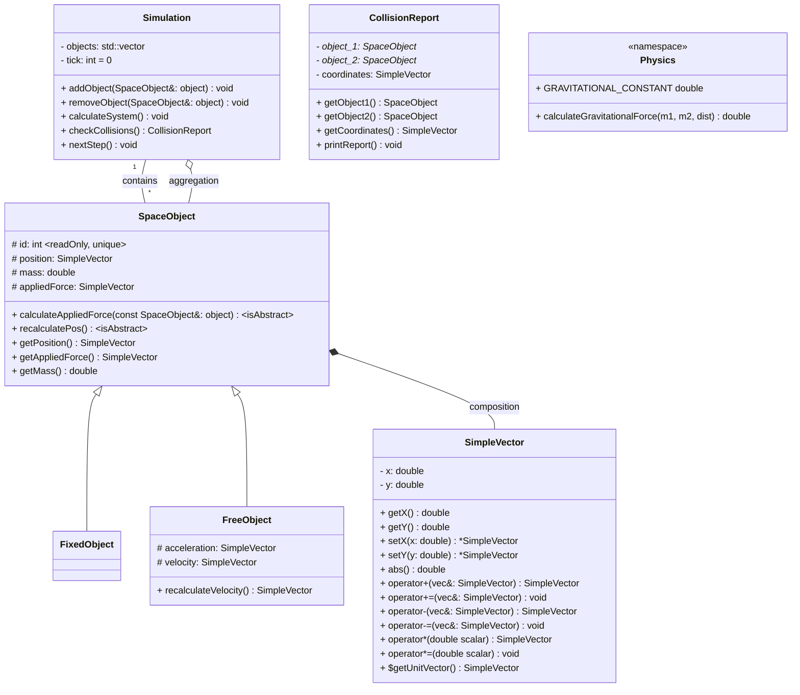
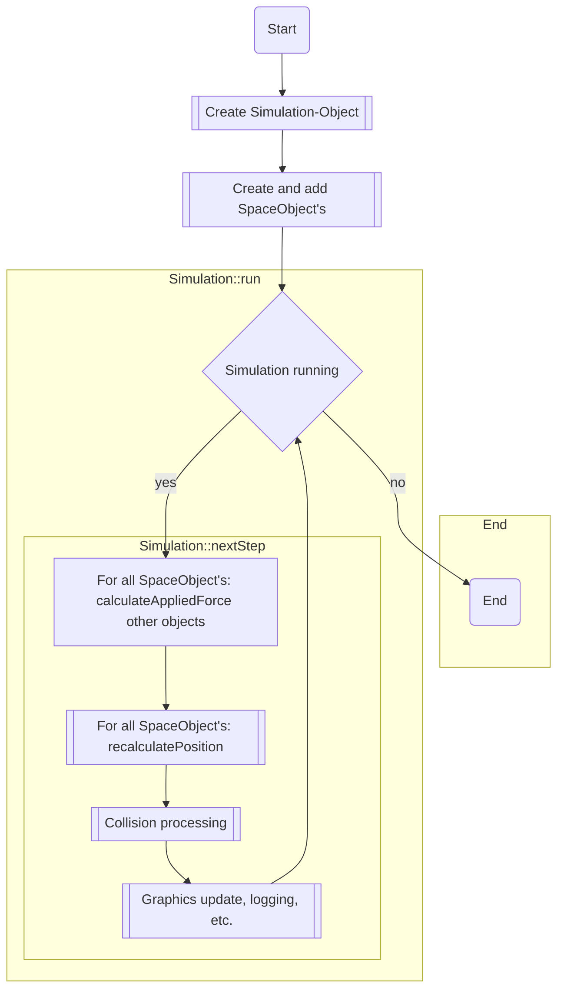

# SOS - Simple Orbit Simulator

## Description
A simple, lightweight C++-based orbital mechanics simulator. It was developed as a training project in physics, mathematics, and object-oriented programming in C++.

## Current State
Development of the core physics engine and architecture.

## Architecture description:

### Core Classes
1) `SpaceObject` - Base class for all objects in the Simulation.
    - `FixedObject` - "Steady" objects or origins, like the Sun in a Solar System model or Earth in an Earth-Moon-Spaceship system.
    - `FreeObject` - All other objects which can move based on physics.
    - *[perspective]* `ActiveObject` - Objects which can move using their own thrust.
2) *[dev]* `Simulation` - The class that contains the simulation loop and objects.
3) `SimpleVector` - Core 2D vector math and logic.
4) *[perspective]* `CollisionReport` - Class to detect and handle collisions.
5) *[perspective]* `Graphics` - The visual part of the simulation.
6) *[dev]* `Logger` - Save the results of simulation

## Process

Currently outlining the "Idea" Flowchart for the main engine loop:

